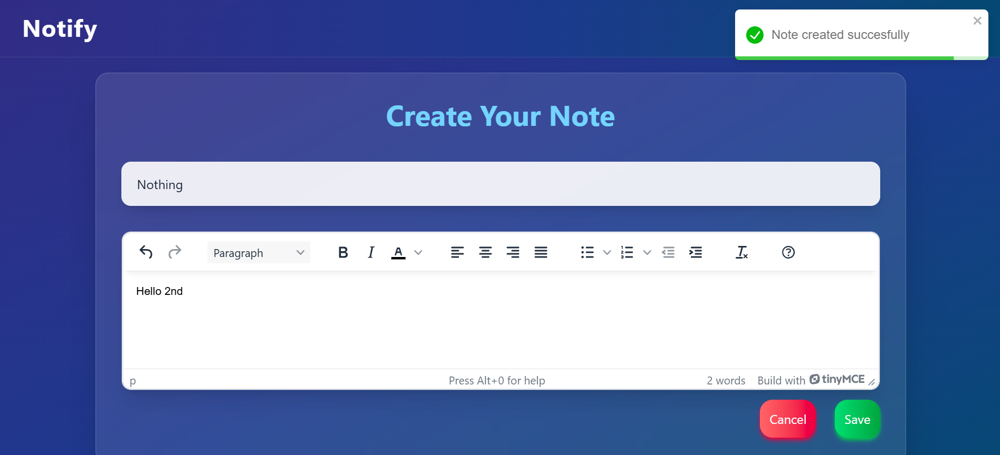

# Notes Management Application (MERN Stack)

A **full-stack Notes Management Application** built with **MongoDB, Express, React, and Node.js**, allowing users to securely create, edit, and manage personal notes. The application features user authentication, protected routes, and a responsive interface, following clean architecture and best practices.

---

## 🎯 Features

- **User Authentication:** Secure login and registration using JWT tokens.
- **CRUD Notes:** Create, read, update, and delete notes.
- **Protected Routes:** Only authenticated users can access their notes.
- **Responsive Design:** Works seamlessly on mobile, tablet, and desktop devices.
- **RESTful APIs:** Efficient communication between frontend and backend.
- **Clean Code & Modular Architecture:** Scalable and maintainable for future enhancements.

---

## 📹 Project Demo

[](https://drive.google.com/file/d/1GvyNMuOINqRv0AM9apjmvbWTUG1NrhtG/view?usp=drive_link)

Click the image above to watch the project in action.

---

## 🖼 Screenshots

### Dashboard


### Create Note


### Edit Note


---

## 🛠 Tech Stack

- **Frontend:** React, Tailwind CSS, React Router
- **Backend:** Node.js, Express.js
- **Database:** MongoDB
- **Authentication:** JWT
- **Tools:** Postman, Git, VS Code

---

## 🚀 Installation

1. **Clone the repository**
   ```bash
   git clone https://github.com/yourusername/notes-app.git ```

  ** Navigate to the backend **

```cd notes-app/backend
npm install```


**Navigate to the frontend**

```cd ../frontend
npm install```


Create a .env file in backend

MONGO_URI=your_mongodb_connection_string
JWT_SECRET=your_jwt_secret
PORT=5000


Run the application

Start backend: npm run dev

Start frontend: npm start
```
